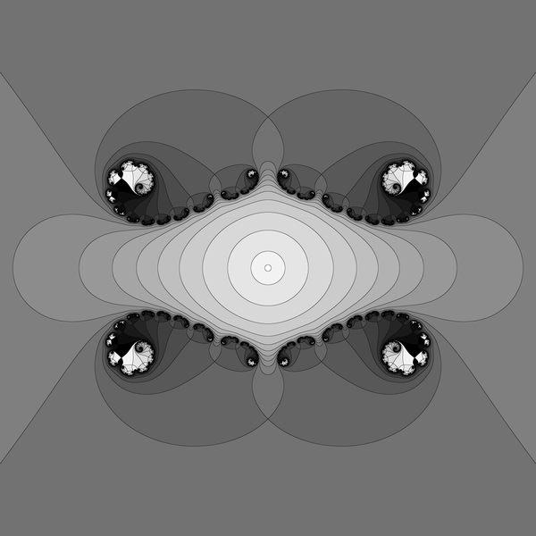

Imploded cauliflower - is a Julia set for c=1/4+epsilon with epsilon >0. 

How many different ways are there to show such set ?

Here c = 0.35 


# Images
See:
* [images in commons category](https://commons.wikimedia.org/wiki/Category:Imploded_cauliflower)


## dynamic plane = z plane

 
 
 
 
 


 
 

 
 
 
 

### procedural texture


 
 

 
 
 
 

 
 
 


### Normal shading
 
 


## Inverted plane  = w plane  = 1/z plane 

 
 
 
 
 
 
 


### Normal shading
 
 


## test images

 
 
 


# Files
* [d.c ](./src/d.c) - c console program for creating pgm images
* [i.c](./src/i.c) - c console program for testing functions from the main program (d.c file). Prints info about point z  
* [g.sh](./src/g.sh) - bash script for conversion ( from pgm to png ) and resizing ( downscalling) using Image Magic


# technical notes


## Contributors

are wellcome 

See als [FF](https://fractalforums.org/programming/11/how-many-different-ways-are-there-to-show-such-set/3874) 


  
## License

[GPL](https://www.gnu.org/licenses/gpl-3.0.html)


## Git

GitLab uses:
* the Redcarpet Ruby library for [Markdown processing](https://gitlab.com/gitlab-org/gitlab-foss/blob/master/doc/user/markdown.md)
* KaTeX to render [math written with the LaTeX syntax](https://gitlab.com/gitlab-org/gitlab-foss/blob/master/doc/user/markdown.md), but [only subset](https://khan.github.io/KaTeX/function-support.html)


### Subdirectory

```git
mkdir images
git add *.png
git mv  *.png ./images
git commit -m "move"
git push -u origin master
```
then link the images:

```txt
 

```

```git
gitm mv -f 
```


### repo


```git
cd existing_folder
git init
git remote add origin git@gitlab.com:adammajewski/implodedcauliflower.git
git add .
git commit -m "Initial commit"
git push -u origin master
```


To clone repo

```git
git clone git@gitlab.com:adammajewski/implodedcauliflower.git
```


Local repo : ~/Dokumenty/branched_ray/c/

